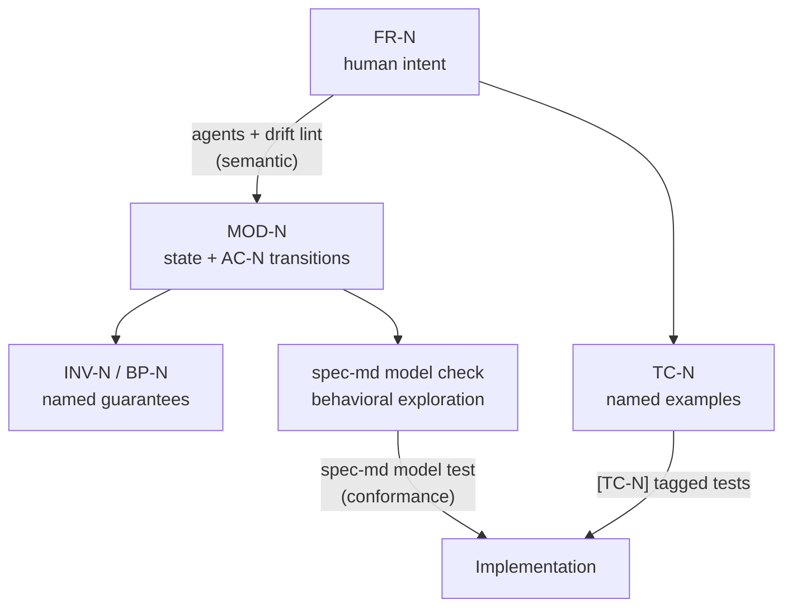

# Behavioral models in spec.md

> Tests protect examples. Models protect behavior.

A test suite passes when the examples someone thought to write still hold. It
says nothing about the combinations nobody wrote down. So an implementation
change can quietly redefine what the product does and still ship green.

A **behavioral model** closes that gap. It is an executable statement of the
contract, written inside the spec, that turns "does the system still do what the
spec says?" into a question a machine can answer — and when the answer is no, it
forces an explicit decision: fix the implementation, or update the spec.

The model layer is **entirely optional**. A `*.spec.md` with no
`### Behavioral Model` section behaves exactly as it always has.

## Contents

- [The four kinds of drift](#the-four-kinds-of-drift)
- [The layers](#the-layers)
- [The state transition model is primary](#the-state-transition-model-is-primary)
- [The language](#the-language)
- [Two kinds of coverage](#two-kinds-of-coverage)
- [Conformance testing](#conformance-testing)
- [The adapter contract](#the-adapter-contract)
- [Drift detection in lint](#drift-detection-in-lint)
- [In CI](#in-ci)
- [Bounds](#bounds)
- [Limits](#limits)

---

## The four kinds of drift

| Drift | What happened |
|-------|---------------|
| **Requirement drift** | The product expectation changed, but the spec was not updated |
| **Implementation drift** | Code changed behavior without changing the spec |
| **Test drift** | Tests no longer adequately enforce the spec |
| **Model drift** | The model no longer represents the written requirements |

`spec-md lint` and `spec-md coverage` already make test drift visible. The model
layer makes implementation drift and model drift visible too, and surfaces
likely requirement drift for a human to judge.

---

## The layers

Each layer has a different role and a different level of formality:

| Layer | Role |
|-------|------|
| Written requirements (`FR-N`) | Human intent |
| Behavioral model (state + actions `AC-N`) | Precise executable contract |
| Invariants and properties (`INV-N`, `BP-N`) | Important named guarantees |
| Generated exploration | Broad behavioral coverage |
| Concrete test cases (`TC-N`) | Named examples and regressions |
| Implementation | Actual behavior |

The formal machinery gives strong guarantees **below the model** — model →
generated checks → implementation. The relationship **above** it, human
requirements ↔ model, is semantic and cannot be proven; there, tooling surfaces
likely inconsistencies and agents help, but judgment stays human.



---

## The state transition model is primary

The model — not the list of properties — is the source of truth. Properties are
*additional* claims about it.

```text
State:
  count: integer

Increment:
  count' = count + 1

Decrement:
  count' = count - 1
```

That matters because the transition model generates broad behavior through
exploration. Forgetting to name a property (`BP-4`) is not catastrophic: the
model still defines what each operation does, and the checker still walks every
state/action combination within its bounds.

In spec.md, that model lives in a fenced ` ```spec-model ` block inside the
spec's `### Behavioral Model` section:

````md
### Behavioral Model

```spec-model
model: MOD-1 Counter
adapter: ./model/counter.adapter.mjs

state:
  count: integer in 0..100 = 0

derived:
  display: count

AC-1 Increment:
  requirement: FR-1
  count' = count + 1

AC-2 Decrement:
  requirement: FR-2
  requires: count > 0
  count' = count - 1

INV-1 The display mirrors the counter:
  requirement: FR-5
  check: display = count

BP-1 Increment changes the counter by exactly one:
  requirement: FR-1
  check: after AC-1, count = count@pre + 1

BP-2 Increment and Decrement are inverses:
  requirement: FR-1, FR-2
  check: AC-1 then AC-2 preserves count
```
````

Ids follow the same hygiene as `FR-N` and `TC-N`: `MOD-1..MOD-n`, `AC-1..AC-n`,
`INV-1..INV-n`, `BP-1..BP-n`, contiguous and ascending in document order.
`spec-md lint` enforces it. `AC`/`INV`/`BP` numbering runs across all of a spec's
model blocks, so an id is unambiguous anywhere in the spec.

A working example: [`examples/counter-js`](./examples/counter-js) (with an
adapter and conformance testing) and
[`examples/pizza-ts`](./examples/pizza-ts/specs/order.spec.md) (a model over a
richer domain).

---

## The language

### `model:` and `adapter:`

```text
model: MOD-1 Counter                        # id and name; defaults to MOD-<block index>
adapter: ./model/counter.adapter.mjs        # spec-relative; required by `model test`
```

### `state:`

One declaration per line, `name: type [in domain] [= default]`.

```text
state:
  count: integer in 0..100 = 0
  total: number = 0
  status: string in [draft, created] = draft
  paid: boolean = false
```

Types are `integer`, `number`, `boolean`, `string`. The **state is an
abstraction** of the implementation, not a copy of it — model what the contract
is about, at the smallest scale that still says something.

`in …` declares a **domain**: `lo..hi` for numbers, `[a, b, c]` for an
enumeration. Domains bound the *search* (see [Bounds](#bounds)); they are not
requirements. Values of a string enum become symbols you can write bare in
expressions (`status = created`), so a typo is an error rather than a silent
mismatch.

### `derived:`

Values computed from the state — what an observer sees rather than what the
system stores.

```text
derived:
  display: count
  average: total / max(1, lineCount)
```

Derived variables are recomputed after every transition, may be used in guards,
invariants, and properties, and cannot be assigned by an action. They are also
compared during conformance, which is what makes `display = count` more than a
tautology: the model computes it, the implementation renders it.

### `AC-N` — actions

```text
AC-3 Set(value: integer in 0..100):
  requirement: FR-3
  requires: status = draft
  count' = value
```

| Line | Meaning |
|------|---------|
| `AC-N Name(params):` | The action. Parameters are declared like state variables, without defaults. |
| `requirement: FR-1, FR-2` | Which `FR-N` this action implements. Traceability upward. |
| `requires: <expr>` | Guard. The action is only offered when it holds. Repeat the line to add clauses (they conjoin). |
| `<var>' = <expr>` | The state after. Every right-hand side reads the **pre**-state, so `a' = b` / `b' = a` swaps. |

An action needs at least one update.

### `INV-N` — invariants

A claim that must hold in **every** state the explorer reaches.

```text
INV-1 A placed order never changes:
  requirement: FR-3
  check: status = created implies total = placedTotal
```

Invariants also define which generated initial states are valid: a candidate
that breaks one is not a legitimate place to start, so it is skipped.

### `BP-N` — behavioral properties

Named claims about the model, in one of three forms:

| Form | Meaning |
|------|---------|
| `after AC-N, <expr>` | Holds in the state after `AC-N`. `x@pre` reads the value before it; the action's parameters are in scope. |
| `AC-N then AC-M preserves <expr>` | Running the sequence leaves the expression unchanged. Parameters shared **by name** across the sequence are bound once, so `AddItem(qty) then RemoveItem(qty)` lines up. |
| `always <expr>` | Holds in every state (an invariant, stated as a property). |

```text
BP-1 Increment changes the counter by exactly one:
  requirement: FR-1
  check: after AC-1, count = count@pre + 1
```

A property that is never *triggered* within the configured bounds is reported —
a claim nothing exercises proves nothing.

### Expressions

Arithmetic `+ - * / %`; comparisons `= (==) != (<>) < <= > >=`; logic `not`,
`and`, `or`, `implies`; parentheses; the functions `min`, `max`, `abs`, `floor`,
`ceil`, `round`; number, string (`"draft"`), and boolean literals; `#` starts a
comment. Expressions are parsed and evaluated by spec.md itself — never `eval` —
so checking a spec never means running code the spec smuggled in.

### Linking test cases

A `TC-N` row may cite the model element it exercises alongside its `FR-N`:

```md
| TC-2 | FR-1, AC-1 | Counter at 100, incremented | Counter is 101 |
```

That completes the chain the ids trace:

```text
FR-1 → BP-1 → AC-1 → TC-1 → [TC-1] test → implementation
```

`spec-md lint` errors on a `TC-N` citing an `AC`/`BP`/`INV`/`MOD` the model does
not declare, the same way it does for a dangling `FR-N`.

---

## Two kinds of coverage

```text
Property coverage:      Did we state and check BP-1 … BP-N?
Behavioral exploration: Did we walk every state/action combination in bounds?
```

`spec-md model check` reports both:

```text
✓ MOD-1 Counter examples/counter-js/counter.spec.md
  explored 20 state(s), 89 transition(s) to depth 4 · 4/4 properties exercised · 1 at the domain frontier
```

Exploration is the half that finds scenarios nobody thought to name. When it
finds one, the search order guarantees the report is the **shortest** trace that
breaks the claim:

```text
Invariant violated

Spec: Pizza Orders
Model: MOD-1 Orders
Invariant: INV-2 The total is never negative — total >= 0

Minimal counterexample:
  Initial state: lineCount = 0, total = 0, status = "draft", placedTotal = 0
  Action: AC-3 ApplyDiscount
  Final state: lineCount = 0, total = -100, status = "draft", placedTotal = 0

Relevant contract:
  FR-2: Compute line and order totals from menu price and size multiplier

Possible resolutions:
  - Fix the transition model so INV-2 holds within these bounds
  - Update INV-2 (and the requirement it cites) if the claim is no longer intended
```

---

## Conformance testing

`spec-md model check` verifies the model against itself. **Conformance** asks the
other question: does the observed implementation conform to the model?

1. Put the model and the application in corresponding initial states.
2. Perform the same action on both.
3. Observe the application.
4. Compare with the model's predicted state.
5. Repeat over many generated starting states and action sequences.

```ts
const model = { count: 100 };
const app = renderCounter({ initialCount: 100 });

model.count += 1;
await app.clickIncrement();

expect(app.displayedCount()).toBe(model.count);
```

`spec-md model test` generates that loop. Because it generates starting states
*and* sequences, it catches changes that are locally reasonable but globally
inconsistent with the existing contract:

```diff
 function increment() {
-  count += 1;
+  count = Math.min(count + 1, 100);
 }
```

```text
Behavioral conformance failed

Spec: Counter
Model: MOD-1 Counter

Minimal counterexample:
  Initial state: count = 100, display = 100
  Action: AC-1 Increment

Expected:
  count = 101
  display = 101

Observed:
  count = 100
  display = 100

Relevant contract:
  FR-1: Incrementing increases the counter by one
  AC-1: count' = count + 1

Possible resolutions:
  - Restore implementation behavior so it still follows AC-1
  - Update FR-1 and AC-1 to define the new behavior, then add the QA Test Case that pins the boundary
```

That turns an accidental behavior change into an explicit product decision. The
PR now needs one of two things:

1. **Fix the implementation** so it still follows the model, or
2. **Update the specification** — "increment increases the count by one when the
   count is below 100; at 100 it leaves the value unchanged" — which forces the
   model to change, which forces a new `TC-N` for the boundary.

Either way the change is visible and deliberate. Nothing silently redefines the
product.

---

## The adapter contract

The adapter is the whole bridge between a model and an implementation. It is an
ES module Node can import, named by the model's `adapter:` key:

```js
// model/counter.adapter.mjs
import { createCounter } from "../src/counter.mjs";

export default {
  // Put the implementation in the model's initial state; return any handle.
  init({ count }) {
    return createCounter({ initialCount: count });
  },

  // One entry per AC-N, keyed by id or by name. Arguments arrive by parameter name.
  actions: {
    "AC-1": (counter) => counter.increment(),
    "AC-2": (counter) => counter.decrement(),
    "AC-3": (counter, { value }) => counter.set(value),
    "AC-4": (counter) => counter.reset(),
  },

  // Report the implementation's state in the model's shape.
  observe(counter) {
    return { count: counter.value(), display: Number(counter.display()) };
  },

  // Optional.
  // teardown(counter) {},
};
```

Every hook may be `async`. Notes:

- **Only keys the model declares are compared.** Extra keys in `observe` are
  ignored, so the adapter can return whatever is convenient. A model variable
  that `observe` never returns is reported as not conformance-checked.
- **Translation is the adapter's job.** Above, the model's `display` is an
  integer while the implementation renders a string. The model should stay an
  abstraction; the adapter reconciles shapes.
- **Each trace gets a fresh handle.** `init` runs per trace, so state cannot
  leak between them.
- Anything Node can import works: a plain module, a rendered component, an HTTP
  client against a running server. A TypeScript project points the adapter at
  compiled output or a `.mjs` shim.

---

## Drift detection in lint

When a requirement changes but the model does not, `spec-md lint` flags the
likely inconsistency. These are heuristics — semantic checks, not proofs — so
they are always warnings, and they only run for specs that declare a model:

```text
▲ Potential requirement/model drift: FR-1 mentions 100, which no model element
  tracing to it (AC-1, BP-1, BP-2) references — the model may need a guard
▲ Potential requirement/model drift: FR-1 constrains behavior ("maximum"), but
  AC-1 declares no `requires:` guard
▲ FR-1 is marked [UPDATED] — confirm the model elements tracing to it
  (AC-1, BP-1, BP-2) still match
```

Also reported: a model element that cites no `FR-N` (the model is no longer
traceable to intent), and a state variable nothing writes and nothing reads
(left over from an earlier model). Pass `--no-drift` to switch the heuristics
off.

---

## In CI

`spec-md check` runs lint, `[TC-N]` coverage, and `model check`. Conformance
executes your implementation, so it stays opt-in:

```yaml
- run: npx @rosenjcb/spec-md check --strict            # includes model check
- run: npx @rosenjcb/spec-md check --strict --conform  # …and conformance
```

Or with the bundled Action:

```yaml
- uses: rosenjcb/spec.md@main
  with:
    path: .
    strict: "true"
    conform: "true"     # also run `model test`
```

`spec-md model check` / `spec-md model test` can also be run on their own, and
`--json` makes either machine-readable.

---

## Bounds

Exploration is exhaustive **within bounds**, never in general. The bounds:

| Flag | Default | What it bounds |
|------|---------|----------------|
| `--depth <n>` | `4` | Length of the action sequences explored |
| `--max-states <n>` | `4000` | State budget for `model check` |
| `--max-traces <n>` | `200` | Trace budget for `model test` |
| `--max-inits <n>` | `8` | Generated initial states |
| `--max-args <n>` | `3` | Values tried per action parameter |

Declared domains do two jobs. They pick what to *generate* — initial states move
one variable at a time to its boundaries (min, max, midpoint, or each enum
value), and parameters are sampled the same way — and they mark the **frontier**:
a transition that leaves a domain produces a state that is still checked against
every invariant and property, but is not expanded further. That is what keeps
`count: integer in 0..100` from turning into a requirement while still bounding
the walk. `model check` reports how many states sat at that frontier.

A model whose search hits `--max-states` says so; the run was not exhaustive.

---

## Limits

Worth knowing before you model something large:

- **Scalar state only.** `integer`, `number`, `boolean`, `string`. No lists,
  maps, or records — model the aggregate (`lineCount`, `total`) instead of the
  collection. This is usually the right abstraction anyway, but it is a real
  ceiling.
- **Guards constrain generation, not the implementation.** A `requires:` clause
  keeps an action out of generated traces; conformance does not assert that the
  implementation rejects the action when the guard is false.
- **Deterministic models.** One state and one argument tuple produce one next
  state. No non-determinism, no concurrency, no time.
- **The layer above stays human.** Drift detection between requirements and
  model is heuristic by nature. Intent is not purely mathematical; tooling can
  surface likely inconsistencies and force a decision, not settle it.

---

## Next readings

- [TESTING.md](./TESTING.md) — the `[TC-N]` tag convention that links concrete
  test cases to the spec.
- [SKILL.md](./SKILL.md) — the authoring procedure agents follow, including when
  a spec is worth modeling.
- [examples/counter-js](./examples/counter-js) — a runnable model, adapter, and
  conformance run, plus a bug the unit tests miss and the model catches.
