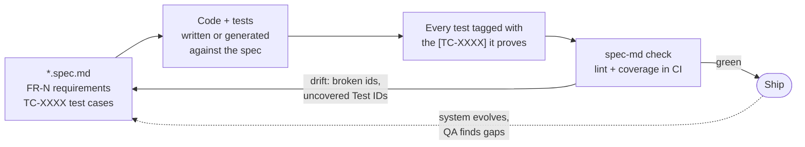
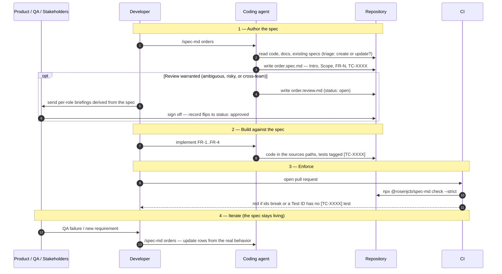
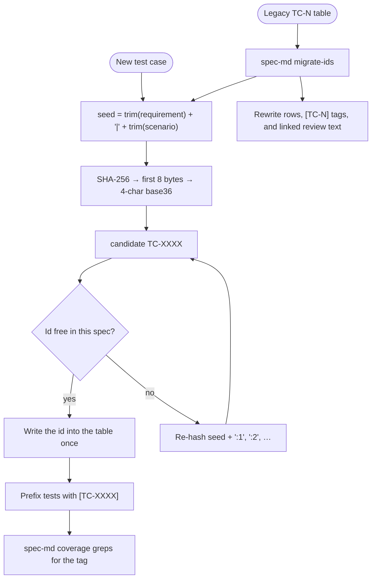

<div align="center">


<h1>spec-md</h1>

<p><strong>An agent-native specification framework for the software development lifecycle.</strong></p>

<p><em>The constraint is no longer implementation speed.<br />The constraint is alignment.</em></p>

<p>
  
  
  
</p>

</div>

---

**spec-md** turns a Markdown spec into the shared source of truth between humans, coding agents, and CI. It ships as three pieces that work together — use any subset:

| Piece | What it is | What it gives you |
|-------|------------|-------------------|
| **The format** | `*.spec.md` — structured Markdown (an [Open Knowledge Format](https://cloud.google.com/blog/products/data-analytics/how-the-open-knowledge-format-can-improve-data-sharing) extension) with numbered Functional Requirements (`FR-N`) and QA Test Cases with stable ids (`TC-XXXX`) | One authoritative, machine-readable description of what a system must do |
| **The skill** | `/spec-md` — authoring guidance installed into Claude Code, Cursor, Codex, Windsurf, Cline, or Copilot | Your agent writes and maintains specs the same way every time, instead of a structure it invents |
| **The tooling** | the [`spec-md` CLI](./cli) and a [GitHub Action](./action.yml) | Specs become checkable artifacts: lint the structure, fail CI when a test case loses its test |

The core loop: **describe behavior once in the spec → build the implementation and the tests against it → tag every test with the `[TC-XXXX]` it proves → let CI fail when the spec and the system drift apart.**

Every spec is written in [Simplified Technical English](#the-language) — one idea per sentence, active voice, one word for one thing — so a requirement means the same to a product manager, a QA engineer, and an agent.

## Contents

- [Motivation](#motivation)
- [How it works](#how-it-works)
- [Install](#install)
- [Quickstart](#quickstart)
- [The commands](#the-commands)
- [The workflow](#the-workflow)
- [Anatomy of a spec](#anatomy-of-a-spec)
- [The language](#the-language)
- [The `[TC-XXXX]` join key](#the-tc-xxxx-join-key)
- [Keeping a spec alive](#keeping-a-spec-alive)
- [Review & sign-off](#review--sign-off)
- [CI](#ci)
- [Who reads a spec](#who-reads-a-spec)
- [Repository map](#repository-map)
- [FAQ](#faq)
- [Next readings](#next-readings)

---

## Motivation

In 2026, most software is no longer written line-by-line by humans. Frontend applications, backend services, infrastructure, migrations, tests, and documentation are routinely generated or assisted by AI systems.

This changes the shape of development. Teams can now produce working software quickly; what used to take weeks can be scaffolded in hours and refined continuously. The constraint is no longer implementation speed.

The constraint is alignment.

As more of the system is produced by agents, ambiguity becomes more expensive. A missing requirement or unclear rule no longer stays local — it gets replicated across the code, tests, APIs, and infrastructure generated from the same misunderstanding. Small gaps in understanding lead to large system drift:

* incorrect implementations
* broken or incomplete test coverage
* inconsistent APIs
* incorrect assumptions in infrastructure
* repeated QA cycles
* rework across multiple services

The faster we generate software, the more important it becomes that we define *what we actually mean* before we generate it.

Modern development already reflects this reality: requirements emerge as teams learn by building, and systems evolve as that understanding improves. That iteration is healthy — the aim is to make it explicit, structured, and shareable instead of leaving it implicit.

spec-md treats software development as a shared knowledge system between Product, Engineering, QA, and AI agents. Instead of static requirement documents, specs become living context that evolves alongside the system they describe. The framework uses and extends the Open Knowledge Format (OKF) to structure that context so it can be consumed by both humans and agents — a consistent, machine-readable model of intent, behavior, and constraints that stays synchronized with the system as it changes, rather than another pile of documentation to maintain by hand.

---

## How it works

A `*.spec.md` file describes one domain of your system: its purpose, its boundaries, its requirements (`FR-N`), and the concrete test cases that prove them (`TC-XXXX`). Each test in your suite carries a bracketed `[TC-XXXX]` prefix in its name, which links the test back to the spec row it validates. Test IDs are stable opaque join keys — not sequence numbers. The `spec-md` CLI cross-references the two. "Does the system still do what the spec says?" becomes a CI check instead of a meeting.



The spec is **living**. When behavior changes, the rows change with it: edit text
in place, append new rows, or delete rows that no longer apply. Lint verifies the
ids. Git (and the PR) is the changelog — the table itself is only the current
contract. The drift only becomes visible when you compare history.

---

## Install

Get spec-md into your project in one line. Every option, flag by flag: **[INSTALL.md](./INSTALL.md)**.

```text
# Claude Code — plugin (/spec-md + /spec-md:check + /spec-md:coverage)
/plugin marketplace add rosenjcb/spec.md
/plugin install spec-md@spec-md
```

```bash
# Cursor / Codex / others — same skill id (spec-md).
# Default (no flags) installs the Claude skill globally + AGENTS.md + .agents/skills/spec-md:
curl -fsSL https://raw.githubusercontent.com/rosenjcb/spec.md/main/install.sh | bash

# To pass flags, either pipe them through bash…
curl -fsSL https://raw.githubusercontent.com/rosenjcb/spec.md/main/install.sh | bash -s -- --cursor

# …or download the script once, then run it with whatever flags you want:
curl -fsSL https://raw.githubusercontent.com/rosenjcb/spec.md/main/install.sh -o install.sh
chmod +x install.sh
./install.sh --cursor   # rule + .agents/skills/spec-md
./install.sh --agents   # AGENTS.md + .agents/skills/spec-md
./install.sh --all      # every agent surface

# CLI — lint specs and check Test ID coverage (great in CI)
npx @rosenjcb/spec-md check
```

| Surface | What you get |
|---------|--------------|
| **Claude Code plugin** | Root `SKILL.md` as `/spec-md` plus the `/spec-md:check` and `/spec-md:coverage` commands. |
| **`install.sh` / `install.ps1`** | Same `spec-md` skill into Claude / `.agents/skills/` (Cursor, Codex) plus per-agent rules and `AGENTS.md`. |
| **[`spec-md` CLI](./cli)** | `lint`, `coverage`, `check`, `list`, `new`, `id`, `migrate-ids` — validate specs and enforce `[TC-XXXX]` coverage. |
| **[GitHub Action](./action.yml)** | `uses: rosenjcb/spec.md@main` — fail CI when a spec drifts or a test case loses its test. |

Every agent rule file is generated from [`SKILL.md`](./SKILL.md) so nothing drifts.

---

## Quickstart

From zero to a checked spec, with an agent doing the writing:

```text
# 1. Install (pick your surface above), then in your agent:
/spec-md orders

#    The skill triages first — is there already a spec for this domain?
#    It reads your code and docs, then writes (or updates) order.spec.md:
#    Intro, Definitions, Scope, FR-N requirements, TC-XXXX test cases.

# 2. Build against it:
"Implement FR-1 through FR-4 and tag each test with the TC-XXXX it proves."

# 3. Verify — structure and coverage in one command:
npx @rosenjcb/spec-md check
```

```text
$ npx @rosenjcb/spec-md check
████████████████████ 100% specs/order.spec.md (9/9)

✓ Overall 100% — 9/9 test cases have a [TC-XXXX] test
```

No agent? The CLI scaffolds the same structure by hand:

```bash
npx @rosenjcb/spec-md new orders     # scaffold orders.spec.md from the template
# fill in the FR/TC tables, prefix your test names with [TC-XXXX], then:
npx @rosenjcb/spec-md check
```

A complete, runnable end-to-end example — spec, code, tagged unit tests, tagged `.http` integration requests, and a signed review record — lives in [`examples/pizza-ts`](./examples/pizza-ts).

---

## The commands

### In your agent

| Command | Available in | What it does |
|---------|--------------|--------------|
| `/spec-md <domain or request>` | Every installed agent (it is the skill itself) | Author **or** update a spec — the skill triages which. It reads the code first and derives the spec from it: branching logic becomes `FR-N` rows, edge cases become TC rows with stable `TC-XXXX` ids, and it wires up the `sources` and `tests` paths. It also decides whether the change needs a [review record](#review--sign-off), and asks you when that is unclear. It lints the spec at the end. |
| `/spec-md:check [path]` | Claude Code plugin | Validate every spec under the path (default: whole repo) — frontmatter, contiguous/ascending `FR-N` ids, stable unique `TC-XXXX` ids, `TC→FR` references, resolvable `sources`/`tests` paths. Reports errors grouped by file and proposes fixes; it does not edit specs unless you ask. |
| `/spec-md:coverage [path]` | Claude Code plugin | Cross-reference each Test ID against the `[TC-XXXX]` tags in the spec's `tests` paths. Lists uncovered test cases, flags orphan tags (a tag in the suite that no spec declares), and recommends the concrete next step for each gap. |

What `/spec-md` actually does, step by step (the full procedure is [`SKILL.md`](./SKILL.md)):

1. **Triage** — create or update? Does the change warrant a stakeholder review?
2. **Gather context** — read the code, existing docs, and (when updating) diff the current spec against reality.
3. **Write** — produce or amend the spec's sections, keeping `FR-N` ids contiguous and TC ids as stable opaque `TC-XXXX` keys.
4. **Link** — point `sources` at the implementation, `tests` at the verification, and make sure every Test ID has a `[TC-XXXX]`-tagged test.
5. **Lint** — run `spec-md lint` and fix what it flags.

In Cursor, Codex, and other agents there are no `:check` / `:coverage` slash commands — the `/spec-md` skill covers authoring, and you (or the agent) run the CLI directly for validation.

### The CLI

Full reference with all flags: [`cli/README.md`](./cli/README.md). Zero runtime dependencies, Node ≥ 18.

| Command | What it does |
|---------|--------------|
| `spec-md lint [paths…]` | Validate frontmatter, contiguous `FR-N` ids, unique stable `TC-XXXX` ids, and `TC→FR` references. |
| `spec-md coverage [paths…]` | Report which Test IDs have at least one `[TC-XXXX]` test, and flag orphan tags. |
| `spec-md check [paths…]` | `lint` + `coverage`, strict — the one to run in CI. |
| `spec-md list [paths…]` | Every spec in the tree, with FR/TC counts and a coverage bar. |
| `spec-md new <domain>` | Scaffold `<domain>.spec.md` from the canonical template. |
| `spec-md id` | Generate a stable `TC-XXXX` from a requirement + scenario seed. |
| `spec-md migrate-ids [paths…]` | Rewrite legacy sequential `TC-N` tables and test tags to `TC-XXXX`. |

Flags worth knowing: `--strict` (exit non-zero on warnings and coverage gaps), `--json` (machine-readable output), `--tests <path>` (override where coverage looks for tags), and `--require-approved` (the [review merge gate](#review--sign-off)).

---

## The workflow

The end-to-end lifecycle of one spec, lane by lane:



The same machinery serves three common situations:

- **New feature, spec first.** Run `/spec-md <domain>` before you write code. The spec becomes the brief the agent implements from, and the QA Test Cases table becomes the test plan. A spec gives the most value here, because you remove the ambiguity *before* it repeats through the code.
- **Existing code, no spec.** Point `/spec-md` at a domain that already works. The skill derives the spec *from the code* — branching logic and validation become `FR-N` rows. Then `spec-md coverage` shows which behaviors have no test to prove them.
- **QA failure or bug report.** First decide which artifact is wrong. If the spec already describes the correct behavior, the *code* drifted: correct the code and keep the `[TC-XXXX]` test accurate. The spec does not change. If the *spec* was wrong, update the rows in place and run `check` again. The full decision tree, including when a change needs a review round, is the flowchart in [REVIEW.md](./REVIEW.md#when-a-review-is-warranted).

---

## Anatomy of a spec

A complete spec is one Markdown file with YAML frontmatter and five sections. Here is a condensed version of the [pizza-ts example spec](./examples/pizza-ts/specs/order.spec.md):

```md
---
type: Spec
title: "Spec: Orders"
sources: [../src/orders, ../src/app.ts]
tests: [../test/orders, ../http/orders.http]
description: The specification for the Orders domain
timestamp: 2026-07-26T00:00:00Z
---

### Intro

The Orders system creates and retrieves customer orders. It is the system of
record for a placed order. After the system creates an order, only an explicit
refund flow can change it.

### Definitions

- Order: A completed purchase transaction, identified by `id`.
- Order Total: The sum of all line totals, in cents.
- Status: The lifecycle state (CREATED, PAID, FULFILLED, REFUNDED).

### Scope

## In Scope
- Create an order from a validated request
- Calculate the totals from the line items

## Out of Scope
- Payment authorization
- Inventory management

### Functional Requirements

| ID   | Requirement |
|------|-------------|
| FR-1 | Create an order from a request that has a customer and one item or more |
| FR-2 | Calculate each line total and the order total from the price and the size multiplier |
| FR-3 | Reject each change to an order after the system creates it |
| FR-4 | Reject a request that has no customer or has an invalid item |

### QA Test Cases

| Test ID | Requirement | Scenario | Expected Outcome |
|---------|-------------|----------|------------------|
| TC-K7MF | FR-1 | The customer submits a valid request | The system creates the order with status CREATED |
| TC-2QXR | FR-2 | The customer orders a large size | The unit price is the base price × 1.6, rounded to the cent |
| TC-8PDA | FR-2 | The order has three line items | The order total is the sum of the three line totals |
| TC-V4WN | FR-3 | The caller changes the returned order object | The stored order does not change |
| TC-91CX | FR-4 | The request has no `customerId` | The API returns status 400 |
```

### Frontmatter

Only `type` and `title` are required; add the rest as the spec matures.

| Key | Required | Purpose |
|-----|----------|---------|
| `type` | **Yes** | The OKF document type. For a `*.spec.md` document this is always `Spec`. |
| `title` | **Yes** | Human-readable name of the spec. |
| `sources` | No | YAML list of spec-relative paths to the code, schemas, or docs that implement the spec. |
| `tests` | No | YAML list of spec-relative paths to the verification that proves it (unit suites, `.http` requests, e2e). |
| `description` | No | One-line summary of what the spec covers. |
| `resource` | No | External URL where the spec is published or synchronized (e.g. a read-only Notion mirror). |
| `review` | No | Spec-relative path to the [sign-off record](#review--sign-off). |
| `tags` | No | Freeform labels for grouping and discovery. |
| `timestamp` | No | ISO 8601 time the spec was last updated. |

`sources` is *what the system does*; `tests` is *what proves it does so*. Both are lists of paths **relative to the spec file itself**, so a spec stays portable regardless of where it lives — next to the code (`src/orders/order.spec.md`) or in a dedicated `specs/` directory, either is fine. Each entry can be a folder or an individual file, and a spec with no implementation or tests yet simply omits them.

### Sections

| Section | Its job |
|---------|---------|
| **Intro** | The system's purpose, its role as system of record, and its lifecycle boundaries — what is immutable, what flows downstream. |
| **Definitions** | Shared vocabulary across Product, Engineering, QA, and agents. Only terms specific to this system or ambiguous without definition; include the field name where it helps (`customerId`, `basePrice` in cents). |
| **Scope** | Two lists — `In Scope` and `Out of Scope`. Being explicit about what the system does *not* own is what prevents responsibility drift. |
| **Functional Requirements** | The `FR-N` table. Each row is a higher-level, *testable* statement of intent — not a vague goal, not an implementation detail. One behavior per row. |
| **QA Test Cases** | The table of stable Test IDs (`TC-XXXX`). Each row cites the `FR-N` it proves and is a deterministic, concrete check — exact input, exact expected outcome. |

### Requirements vs. test cases

A requirement expresses higher-level intent; the test cases are the concrete checks that prove it — so a single `FR-N` usually owns **several** TC rows. Above, `FR-2` (pricing) is proven by both `TC-2QXR` (size multiplier) and `TC-8PDA` (multiple line items), and a real pricing requirement might add cases for rounding and currency. The `Requirement` column is what keeps that fan-out traceable.

This is also the natural tension in the format. A spec needs enough detail to remove ambiguity, but not so much rigidity that it goes stale as the system changes. Cover the happy path first, then the edge cases, then the error conditions. Let the spec record how the understanding changes instead of fixing it in place.

---

## The language

Specs are written in **[ASD-STE100 Simplified Technical English](https://www.asd-ste100.org/)** (STE) — the controlled-English standard the aerospace industry wrote so that one maintenance procedure means one thing to every reader. A spec has the same problem: Product, Engineering, QA, and agents all act on the same sentence, and many of those readers do not speak English as a first language.

Six rules do most of the work:

1. **One idea per sentence** — 20 words for a requirement, 25 for descriptive text.
2. **Active voice, simple tense.**
3. **One word, one meaning** — the same name for the same thing every time.
4. **No `-ing` forms**, unless the word is a technical name (`routing key`).
5. **Plain words** — `use`, not `utilize`.
6. **No idiom, metaphor, or humor.**

| Instead of | Write |
|------------|-------|
| Orders that have been submitted are subsequently priced by the pricing engine utilizing the applicable multipliers. | The pricing engine prices a submitted order. It multiplies the base price by the size multiplier. |
| Prevent post-creation mutation of the order aggregate. | Do not let a user change an order after the system creates it. |
| Handle bad input gracefully. | Reject a request that has no `customerId`. Return status 400. |

The right-hand column is what `FR-3` and `TC-V4WN` above already look like. [`SKILL.md`](./SKILL.md#the-language-simplified-technical-english) carries these rules into every agent surface, so a spec an agent writes for you arrives in STE by default.

The rules govern what the toolset produces — specs, review records, and the test names that carry the `[TC-XXXX]` tags — along with the conventions that teach them ([TESTING.md](./TESTING.md), [REVIEW.md](./REVIEW.md), [INSTALL.md](./INSTALL.md)). Prose that makes an argument rather than stating a behavior, like the [Motivation](#motivation) above, is still prose. STE is there to stop a requirement from meaning two things, not to make everything read like a maintenance manual.

---

## The `[TC-XXXX]` join key

Every test-case row becomes real through a test whose **name carries the tag as a bracketed prefix**. That tag is the whole contract between the spec and the suite — the join key the tooling greps for. The id is a stable opaque string in the form `TC-[A-Z0-9]{4}` (for example `TC-91CX`), not a row index:

```ts
// test/orders.test.ts
it("[TC-91CX] Given a request with no customerId, when the store creates the order, then it throws a ValidationError", () => {
  expect(() => store.create({ customerId: "", items: [/* … */] })).toThrow(ValidationError);
});
```

Generate a new id with `spec-md id --requirement FR-4 --scenario "…"`. Never invent `TC-1`, and never renumber existing ids when you insert, delete, or reorder rows.



How allocation works (detail in [`cli/README.md`](./cli/README.md#stable-test-ids)):

1. **Seed** is `requirement|scenario` only — Expected Outcome can change without a new id.
2. **Hash** is SHA-256 of the seed, reduced to four uppercase base36 characters (`0-9A-Z`).
3. **Collisions** re-hash `seed:1`, `seed:2`, … until the id is free in that spec (like open addressing).
4. **After write, the id is permanent.** Do not re-run generation when you edit the row text.
5. **Pass `--used`** when allocating next to existing rows so the tool skips taken ids.

The convention does not depend on the runner. The same tag works in a Vitest name, a JUnit display name, or an `.http` request assertion. We suggest Gherkin *Given / When / Then* phrasing, because it makes each test name its precondition, its action, and its outcome. It is not a requirement: `[TC-JKUK] returns 404 for an unknown order id` is equally valid. One Test ID can have many tests — a unit test that proves the logic and an integration test that proves the wiring both point at the same row.

`spec-md coverage` reads the `tests` paths of each spec, scans them for tags, and reports the match:

- an **uncovered Test ID** means the spec promises a check that nothing performs — write the test;
- an **orphan `[TC-XXXX]`** means the suite verifies behavior that the spec never declared — add the row, or tag the test `[smoke]` if it is not an acceptance criterion.

The full convention, including `.http` integration requests: **[TESTING.md](./TESTING.md)**.

---

## Keeping a spec alive

You update a spec in place, and the ids carry the load, because the `[TC-XXXX]` tags in the test suite point at them. The update rules (`spec-md lint` enforces them, and [`SKILL.md`](./SKILL.md) specifies them in full):

- **FR ids stay contiguous and ascending** — the FR table is exactly `FR-1..FR-n` in row order, with no gaps. Append `n + 1` for a new requirement.
- **Test IDs are stable opaque join keys** (`TC-XXXX`). Generate a new id for a new case; never renumber or reuse. Reorder and delete freely — a gap is not a missing test.
- **Changed behavior edits the text of the row**, not its Test ID.
- **Removed behavior deletes the row** and its matching `[TC-XXXX]` tests in the same change. Do not leave lifecycle tags in the table. Git history is the delta.
- **Do not use `[NEW]`, `[UPDATED]`, or `[REMOVED]`** — the table is the current contract only.
- **`timestamp` changes** on every update.
- **Legacy sequential tables** (`TC-1`, `TC-2`, …) migrate with `spec-md migrate-ids`.

`/spec-md` applies these rules for you, with `spec-md lint` as the gate.

---

## Review & sign-off

Most specs need no review, because ordinary PR review carries a small, unambiguous change. A spec gains a sign-off record when the change is **ambiguous** (two reasonable people could build different things), has a wide **impact**, or needs agreement from **stakeholders outside the PR**. The record is a `*.review.md` file beside the spec (`order.spec.md` → `order.review.md`), linked from the `review` key of the spec.

The record states who holds each role (driver, approvers, contributors, informed — [DACI](https://www.atlassian.com/team-playbook/plays/daci)), which kind of review it is (`notice` for awareness, `signoff` for accountability), which milestone it gates (`kickoff`, `pre-build`, `pre-release`), and the approval state (`open` → `approved` or `rejected`). Each stakeholder gets a **briefing derived from the spec** for their role. It is never a restatement maintained by hand, which can drift, and never a bare "please read the spec".

The record is a file with a `status`, so a review becomes a merge gate when you want one:

```bash
npx @rosenjcb/spec-md check --require-approved
# fails while any spec links a review record whose status is not approved
```

Specs with no linked review are never gated — the lifecycle is opt-in per spec. The complete convention, including the record format and a worked example: **[REVIEW.md](./REVIEW.md)**.

---

## CI

The bundled GitHub Action fails a build when a spec breaks or a Test ID loses its test:

```yaml
# .github/workflows/specs.yml
name: specs
on: [push, pull_request]
jobs:
  spec-md:
    runs-on: ubuntu-latest
    steps:
      - uses: actions/checkout@v4
      - uses: actions/setup-node@v4
        with: { node-version: "20" }
      - uses: rosenjcb/spec.md@main
        with:
          path: .
          strict: "true"
          # require-approved: "true"   # opt-in review merge gate
```

Or skip the action and run the CLI directly:

```yaml
- run: npx @rosenjcb/spec-md check --strict
```

---

## Who reads a spec

A spec is the authoritative description of a system — what it does, why it exists, and how it must behave. It serves each role differently:

| Audience | The spec gives them |
|----------|---------------------|
| **Business stakeholders** | The problem being solved, expected outcomes, constraints, and the intent behind the product. |
| **Product & design** | Behavior and interaction rules, flows, edge cases, and usability constraints. |
| **Engineering** | System boundaries and responsibilities, data contracts, validation rules, and invariants. |
| **QA** | Expected behavior, acceptance criteria (Test IDs), failure conditions, and regression coverage. |
| **AI agents** | Executable context — what to build, what *not* to build, how components should behave, and how to validate correctness. |

A spec does more than describe a feature. It is a shared model of the system that connects intent to implementation.

---

## Repository map

| Path | What it is |
|------|------------|
| [`SKILL.md`](./SKILL.md) | The canonical skill — the single source of truth every adapter is generated from, and the Claude Code plugin's skill. |
| [`commands/`](./commands) | The Claude Code plugin slash commands (`/spec-md:check`, `/spec-md:coverage`). |
| `AGENTS.md`, `.cursor/`, `.windsurf/`, `.clinerules/`, `.github/copilot-instructions.md`, `.agents/skills/spec-md/` | Generated per-agent adapters — never edit by hand; run `pnpm run sync`. |
| [`cli/`](./cli) | The `@rosenjcb/spec-md` CLI (npm). |
| [`action.yml`](./action.yml) | The GitHub Action wrapping `spec-md check`. |
| [`install.sh`](./install.sh) / [`install.ps1`](./install.ps1) | One-line installers for every agent surface. |
| [`examples/pizza-ts`](./examples/pizza-ts) | Runnable reference: spec + review record + tagged unit tests + tagged `.http` requests. |
| [`TESTING.md`](./TESTING.md) / [`REVIEW.md`](./REVIEW.md) / [`INSTALL.md`](./INSTALL.md) | The companion conventions in depth. |

---

## FAQ

**Where do spec files live?**
Anywhere. `sources` and `tests` are relative to the spec file, so `src/orders/order.spec.md` and `specs/order.spec.md` are both fine — the example repo uses a `specs/` folder, but that is a convention, not a requirement.

**Do I need the CLI to use the format?**
No. The format and the skill work on their own — the CLI is what makes specs *enforceable* (lint + coverage as a CI gate) instead of merely readable.

**Do I need a review record for every spec?**
No — most specs never need one. Reviews are opt-in per spec, reserved for changes that are ambiguous, risky, or cross-team. A spec with no `review` key trips no gate.

**Claude Code: plugin or skill-only?**
One or the other, not both — installing both duplicates the `/spec-md` entry. The plugin adds the `:check` / `:coverage` commands; the skill-only install is just the authoring guidance.

**A test in my suite has no matching Test ID row. Is that a failure?**
It is a signal: either the spec is missing a row (add it — the behavior is evidently worth verifying) or the test is not an acceptance criterion (tag it `[smoke]` instead).

**Does an approved review lock the spec?**
No. `status: approved` records that a review round finished. The spec keeps living. The driver decides when a later change needs a new review. "What changed since you signed" is the git (and PR) delta against the pinned `revision` on the review record — not tags inside the table.

**What is OKF?**
The [Open Knowledge Format](https://github.com/GoogleCloudPlatform/knowledge-catalog/blob/main/okf/SPEC.md) — Markdown documents with typed YAML frontmatter, designed to be consumed by humans and agents alike. spec-md extends it with the `Spec` and `Review` document types.

---

## Next readings

- [TESTING.md](./TESTING.md) — how tests relate to a `*.spec.md`. Covers unit and integration tests and the `[TC-XXXX]` tag convention embedded in the test name, where the tag links each test back to a QA Test Case in the spec. Suggests (but does not require) Gherkin **Given / When / Then** phrasing.
- [REVIEW.md](./REVIEW.md) — how a spec gets reviewed and signed off. A `*.review.md` record beside the spec (OKF `type: Review`) carries the roles, per-stakeholder briefings, and the approval state — everything derived from the spec, never a hand-maintained copy that can drift.
- [SKILL.md](./SKILL.md) — the full procedure an agent follows: triage, context gathering, the Simplified Technical English rules, the writing rules for each section, and the id rules for an update.
- [INSTALL.md](./INSTALL.md) — every way to get spec-md into a project, per agent, flag by flag.
- [examples/pizza-ts](./examples/pizza-ts) — a runnable reference implementation generated from a single OKF spec, with tagged unit tests and `.http` integration requests that trace back to it.

### Appendix: References

- Google Cloud Blog: How the Open Knowledge Format can improve data sharing: https://cloud.google.com/blog/products/data-analytics/how-the-open-knowledge-format-can-improve-data-sharing
- GoogleCloudPlatform OKF Spec: https://github.com/GoogleCloudPlatform/knowledge-catalog/blob/main/okf/SPEC.md
- ASD-STE100 Simplified Technical English: https://www.asd-ste100.org/
