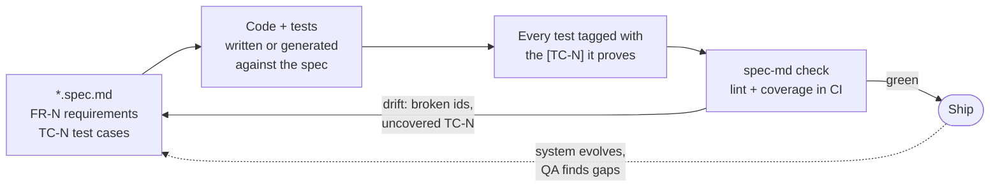
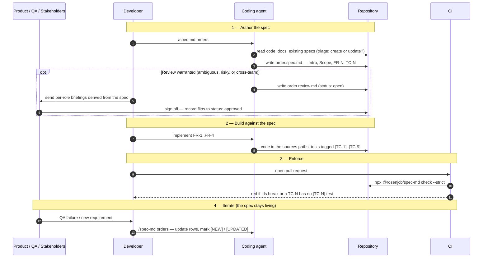

<div align="center">


<h1>spec.md</h1>

<p><strong>An agent-native specification framework for the software development lifecycle.</strong></p>

<p><em>The constraint is no longer implementation speed.<br />The constraint is alignment.</em></p>

<p>
  
  
  
</p>

</div>

---

**spec.md** turns a Markdown spec into the shared source of truth between humans, coding agents, and CI. It ships as three pieces that work together — use any subset:

| Piece | What it is | What it gives you |
|-------|------------|-------------------|
| **The format** | `*.spec.md` — structured Markdown (an [Open Knowledge Format](https://cloud.google.com/blog/products/data-analytics/how-the-open-knowledge-format-can-improve-data-sharing) extension) with numbered Functional Requirements (`FR-N`) and QA Test Cases (`TC-N`) | One authoritative, machine-readable description of what a system should do |
| **The skill** | `/spec-md` — authoring guidance installed into Claude Code, Cursor, Codex, Windsurf, Cline, or Copilot | Your agent writes and maintains specs the same way every time, instead of inventing structure |
| **The tooling** | the [`spec-md` CLI](./cli) and a [GitHub Action](./action.yml) | Specs become checkable artifacts: lint the structure, fail CI when a test case loses its test |

The core loop: **describe behavior once in the spec → build the implementation and tests against it → tag every test with the `[TC-N]` it proves → let CI fail when spec and system drift apart.**

## Contents

- [How it works](#how-it-works)
- [Install](#install)
- [Quickstart](#quickstart)
- [The commands](#the-commands)
- [The workflow](#the-workflow)
- [Anatomy of a spec](#anatomy-of-a-spec)
- [The `[TC-N]` join key](#the-tc-n-join-key)
- [Keeping a spec alive](#keeping-a-spec-alive)
- [Review & sign-off](#review--sign-off)
- [CI](#ci)
- [Motivation](#motivation)
- [Who reads a spec](#who-reads-a-spec)
- [Repository map](#repository-map)
- [FAQ](#faq)
- [Next readings](#next-readings)

---

## How it works

A `*.spec.md` file describes one domain of your system: its purpose, boundaries, requirements (`FR-N`), and the concrete test cases that prove them (`TC-N`). Each test in your suite carries a bracketed `[TC-N]` prefix in its name, linking it back to the spec row it validates. The `spec-md` CLI cross-references the two, so "does the system still do what the spec says?" becomes a CI check instead of a meeting.



The spec is **living**: when behavior changes, the spec rows change with it (marked `[NEW]` / `[UPDATED]` / `[REMOVED]`), and lint keeps the ids honest. Nothing freezes; drift just becomes visible.

---

## Install

Get spec.md into your project in one line. Every option, flag by flag: **[INSTALL.md](./INSTALL.md)**.

```bash
# Claude Code — plugin (/spec-md + /spec-md:check + /spec-md:coverage)
/plugin marketplace add rosenjcb/spec.md
/plugin install spec-md@spec-md

# Cursor / Codex / others — same skill id (spec-md); default also writes AGENTS.md
curl -fsSL https://raw.githubusercontent.com/rosenjcb/spec.md/main/install.sh | bash
# ./install.sh --cursor   # rule + .agents/skills/spec-md
# ./install.sh --agents   # AGENTS.md + .agents/skills/spec-md
# ./install.sh --all

# CLI — lint specs and check TC-N test coverage (great in CI)
npx @rosenjcb/spec-md check
```

| Surface | What you get |
|---------|--------------|
| **Claude Code plugin** | Root `SKILL.md` as `/spec-md` plus the `/spec-md:check` and `/spec-md:coverage` commands. |
| **`install.sh` / `install.ps1`** | Same `spec-md` skill into Claude / `.agents/skills/` (Cursor, Codex) plus per-agent rules and `AGENTS.md`. |
| **[`spec-md` CLI](./cli)** | `lint`, `coverage`, `check`, `list`, `new` — validate specs and enforce `[TC-N]` coverage. |
| **[GitHub Action](./action.yml)** | `uses: rosenjcb/spec.md@main` — fail CI when a spec drifts or a test case loses its test. |

Every agent rule file is generated from [`SKILL.md`](./SKILL.md) so nothing drifts.

---

## Quickstart

From zero to a checked spec, with an agent doing the writing:

```text
# 1. Install (pick your surface above), then in your agent:
/spec-md orders

#    The skill triages first — is there already a spec covering this domain?
#    It reads your code and docs, then writes (or updates) order.spec.md:
#    Intro, Definitions, Scope, FR-N requirements, TC-N test cases.

# 2. Build against it:
"Implement FR-1 through FR-4 and tag each test with the TC-N it proves."

# 3. Verify — structure and coverage in one command:
npx @rosenjcb/spec-md check
```

```text
$ npx @rosenjcb/spec-md check
████████████████████ 100% specs/order.spec.md (9/9)

✓ Overall 100% — 9/9 test cases have a [TC-N] test
```

No agent? The CLI scaffolds the same structure by hand:

```bash
npx @rosenjcb/spec-md new orders     # scaffold orders.spec.md from the template
# fill in the FR/TC tables, prefix your test names with [TC-N], then:
npx @rosenjcb/spec-md check
```

A complete, runnable end-to-end example — spec, code, tagged unit tests, tagged `.http` integration requests, and a signed review record — lives in [`examples/pizza-ts`](./examples/pizza-ts).

---

## The commands

### In your agent

| Command | Available in | What it does |
|---------|--------------|--------------|
| `/spec-md <domain or request>` | Every installed agent (it is the skill itself) | Author **or** update a spec — the skill triages which. It reads the code first and derives the spec from it: branching logic becomes `FR-N` rows, edge cases become `TC-N` rows, and `sources`/`tests` paths get wired up. It also decides (and asks, when unclear) whether the change warrants a [review record](#review--sign-off), and finishes by linting. |
| `/spec-md:check [path]` | Claude Code plugin | Validate every spec under the path (default: whole repo) — frontmatter, unique/contiguous/ascending `FR-N`/`TC-N` ids, `TC→FR` references, resolvable `sources`/`tests` paths. Reports errors grouped by file and proposes fixes; it does not edit specs unless you ask. |
| `/spec-md:coverage [path]` | Claude Code plugin | Cross-reference each `TC-N` row against the `[TC-N]` tags in the spec's `tests` paths. Lists uncovered test cases, flags orphan tags (a `[TC-N]` in the suite that no spec declares), and recommends the concrete next step for each gap. |

What `/spec-md` actually does, step by step (the full procedure is [`SKILL.md`](./SKILL.md)):

1. **Triage** — create or update? Does the change warrant a stakeholder review?
2. **Gather context** — read the code, existing docs, and (when updating) diff the current spec against reality.
3. **Write** — produce or amend the spec's sections, keeping `FR-N`/`TC-N` ids contiguous.
4. **Link** — point `sources` at the implementation, `tests` at the verification, and make sure every `TC-N` has a `[TC-N]`-tagged test.
5. **Lint** — run `spec-md lint` and fix what it flags.

In Cursor, Codex, and other agents there are no `:check` / `:coverage` slash commands — the `/spec-md` skill covers authoring, and you (or the agent) run the CLI directly for validation.

### The CLI

Full reference with all flags: [`cli/README.md`](./cli/README.md). Zero runtime dependencies, Node ≥ 18.

| Command | What it does |
|---------|--------------|
| `spec-md lint [paths…]` | Validate frontmatter, `FR-N`/`TC-N` id integrity (unique, contiguous, ascending), and `TC→FR` references. |
| `spec-md coverage [paths…]` | Report which `TC-N` rows have at least one `[TC-N]` test, and flag orphan tags. |
| `spec-md check [paths…]` | `lint` + `coverage`, strict — the one to run in CI. |
| `spec-md list [paths…]` | Every spec in the tree, with FR/TC counts and a coverage bar. |
| `spec-md new <domain>` | Scaffold `<domain>.spec.md` from the canonical template. |

Flags worth knowing: `--strict` (exit non-zero on warnings and coverage gaps), `--json` (machine-readable output), `--tests <path>` (override where coverage looks for tags), and `--require-approved` (the [review merge gate](#review--sign-off)).

---

## The workflow

The end-to-end lifecycle of one spec, lane by lane:



The same machinery serves three common situations:

- **New feature, spec first.** Run `/spec-md <domain>` before writing code. The spec becomes the brief the agent implements from, and the `TC-N` table becomes the test plan. This is where specs pay off most — ambiguity is resolved *before* it gets replicated into code.
- **Existing code, no spec.** Point `/spec-md` at a domain that already works. The skill derives the spec *from the code* — branching logic and validation become `FR-N` rows — then `spec-md coverage` shows exactly which behaviors have no proving test.
- **QA failure / bug report.** First decide which artifact is wrong. If the spec already describes correct behavior, the *code* drifted: fix the code and keep the `[TC-N]` test honest — no spec change needed. If the *spec* was wrong, update the rows in place, mark them `[UPDATED]`, and let `check` re-verify. The full decision tree — including when a change deserves a review round — is the flowchart in [REVIEW.md](./REVIEW.md#when-a-review-is-warranted).

---

## Anatomy of a spec

A complete spec is one Markdown file with YAML frontmatter and five sections. Here is a condensed version of the [pizza-ts example spec](./examples/pizza-ts/specs/order.spec.md):

```md
---
type: Spec
title: "Spec: Orders"
sources: [../src/orders, ../src/app.ts]
tests: [../test/orders, ../http/orders.http]
description: The specification for the Orders domain
timestamp: 2026-07-26T00:00:00Z
---

### Intro

The Orders system handles creation and retrieval of customer orders. It is
the system of record for placed orders; once created, an order is immutable
except through explicit refund flows.

### Definitions

- Order: A completed purchase transaction, identified by `id`.
- Order Total: Sum of all line totals, in cents.
- Status: Lifecycle state (CREATED, PAID, FULFILLED, REFUNDED).

### Scope

## In Scope
- Create orders from validated requests
- Compute totals from line items

## Out of Scope
- Payment authorization
- Inventory management

### Functional Requirements

| ID   | Requirement |
|------|-------------|
| FR-1 | Create an order from a request with a customer and at least one item |
| FR-2 | Compute line and order totals from price and size multiplier |
| FR-3 | Prevent modification of an order after creation |
| FR-4 | Reject requests missing a customer or with invalid items |

### QA Test Cases

| Test ID | Requirement | Scenario | Expected Outcome |
|---------|-------------|----------|------------------|
| TC-1 | FR-1 | Valid request submitted | Order created with status CREATED |
| TC-2 | FR-2 | Larger size priced | Unit price scaled by multiplier, rounded |
| TC-3 | FR-2 | Order with several line items | Total sums each line |
| TC-4 | FR-3 | Mutate returned order object | Stored order is unchanged |
| TC-5 | FR-4 | Missing customerId | 400 validation error |
```

### Frontmatter

Only `type` and `title` are required; add the rest as the spec matures.

| Key | Required | Purpose |
|-----|----------|---------|
| `type` | **Yes** | The OKF document type. For a spec.md file this is always `Spec`. |
| `title` | **Yes** | Human-readable name of the spec. |
| `sources` | No | YAML list of spec-relative paths to the code, schemas, or docs that implement the spec. |
| `tests` | No | YAML list of spec-relative paths to the verification that proves it (unit suites, `.http` requests, e2e). |
| `description` | No | One-line summary of what the spec covers. |
| `resource` | No | External URL where the spec is published or synchronized (e.g. a read-only Notion mirror). |
| `review` | No | Spec-relative path to the [sign-off record](#review--sign-off). |
| `tags` | No | Freeform labels for grouping and discovery. |
| `timestamp` | No | ISO 8601 time the spec was last updated. |

`sources` is *what the system does*; `tests` is *what proves it does so*. Both are lists of paths **relative to the spec file itself**, so a spec stays portable regardless of where it lives — next to the code (`src/orders/order.spec.md`) or in a dedicated `specs/` directory, either is fine. Each entry can be a folder or an individual file, and a spec with no implementation or tests yet simply omits them.

### Sections

| Section | Its job |
|---------|---------|
| **Intro** | The system's purpose, its role as system of record, and its lifecycle boundaries — what is immutable, what flows downstream. |
| **Definitions** | Shared vocabulary across Product, Engineering, QA, and agents. Only terms specific to this system or ambiguous without definition; include the field name where it helps (`customerId`, `basePrice` in cents). |
| **Scope** | Two lists — `In Scope` and `Out of Scope`. Being explicit about what the system does *not* own is what prevents responsibility drift. |
| **Functional Requirements** | The `FR-N` table. Each row is a higher-level, *testable* statement of intent — not a vague goal, not an implementation detail. One behavior per row. |
| **QA Test Cases** | The `TC-N` table. Each row cites the `FR-N` it proves and is a deterministic, concrete check — exact input, exact expected outcome. |

### Requirements vs. test cases

A requirement expresses higher-level intent; the test cases are the concrete checks that prove it — so a single `FR-N` usually owns **several** `TC-N` rows. Above, `FR-2` (pricing) is proven by both `TC-2` (size multiplier) and `TC-3` (multiple line items), and a real pricing requirement might add cases for rounding and currency. The `Requirement` column is what keeps that fan-out traceable.

This is also the format's natural tension: a spec needs enough detail to remove ambiguity, but not so much rigidity that it goes stale as the system evolves. Cover the happy path first, then edge cases, then error conditions — and let the spec track how understanding changes rather than trying to freeze it.

---

## The `[TC-N]` join key

Every `TC-N` row becomes real through a test whose **name carries the tag as a bracketed prefix**. That tag is the entire contract between spec and suite — the join key the tooling greps for:

```ts
// test/orders.test.ts
it("[TC-5] Given a request without a customerId, when the order is created, then a ValidationError is thrown", () => {
  expect(() => store.create({ customerId: "", items: [/* … */] })).toThrow(ValidationError);
});
```

The convention is runner-agnostic — the same tag works in a Vitest name, a JUnit display name, or an `.http` request assertion. Gherkin *Given / When / Then* phrasing is suggested (it forces each test to name its precondition, action, and outcome) but not required; `[TC-5] returns 404 for an unknown order id` is equally valid. One `TC-N` may have many tests — a unit test proving the logic and an integration test proving the wiring both point at the same row.

`spec-md coverage` reads each spec's `tests` paths, scans them for tags, and reports the match:

- an **uncovered `TC-N`** means the spec promises a check that nothing performs — write the test;
- an **orphan `[TC-N]`** means the suite verifies behavior the spec never declared — add the row, or retag it `[smoke]` if it is not an acceptance criterion.

The full convention, including `.http` integration requests: **[TESTING.md](./TESTING.md)**.

---

## Keeping a spec alive

Specs are updated in place, and the ids are load-bearing — `[TC-N]` tags in the test suite point at them. The update rules (enforced by `spec-md lint`, fully specified in [`SKILL.md`](./SKILL.md)):

- **Ids stay contiguous and ascending** — every table is exactly `FR-1..FR-n` / `TC-1..TC-n` in row order, no skips.
- **New rows append** at the end as `n + 1`; never invent a mid-range id or reuse a live one.
- **Changed behavior edits the row's text**, not its number.
- **Removed behavior is marked `[REMOVED]`** (keeping its index) rather than silently deleted; once nothing references it, delete and renumber `1..n` — updating every `[TC-N]` test tag in the same change.
- **`[NEW]` / `[UPDATED]` markers** flag rows while a change is in review, and drop once merged.
- **`timestamp` bumps** on every update.

Renumbering and tag-updating is mechanical and cross-file — exactly the kind of chore `/spec-md` handles for you, with `spec-md lint` as the gate.

---

## Review & sign-off

Most specs need no review — ordinary PR review carries small, unambiguous changes. When a change is **ambiguous** (two reasonable people could build different things), has a wide **blast radius**, or needs agreement from **stakeholders outside the PR**, the spec gains a sign-off record: a `*.review.md` file beside it (`order.spec.md` → `order.review.md`), linked from the spec's `review` key.

The record carries who holds each role (driver, approvers, contributors, informed — [DACI](https://www.atlassian.com/team-playbook/plays/daci)), what kind of review it is (`notice` for awareness, `signoff` for accountability), which milestone it gates (`kickoff`, `pre-build`, `pre-release`), and the approval state (`open` → `approved` / `rejected`). Each stakeholder gets a **briefing derived from the spec** for their role — never a hand-maintained restatement that can drift, never a bare "please read the spec".

Because the record is a file with a `status`, review becomes a merge gate when you want one:

```bash
npx @rosenjcb/spec-md check --require-approved
# fails while any spec links a review record whose status is not approved
```

Specs with no linked review are never gated — the lifecycle is opt-in per spec. The complete convention, including the record format and a worked example: **[REVIEW.md](./REVIEW.md)**.

---

## CI

The bundled GitHub Action fails a build when a spec breaks or a `TC-N` loses its test:

```yaml
# .github/workflows/specs.yml
name: specs
on: [push, pull_request]
jobs:
  spec-md:
    runs-on: ubuntu-latest
    steps:
      - uses: actions/checkout@v4
      - uses: actions/setup-node@v4
        with: { node-version: "20" }
      - uses: rosenjcb/spec.md@main
        with:
          path: .
          strict: "true"
          # require-approved: "true"   # opt-in review merge gate
```

Or skip the action and run the CLI directly:

```yaml
- run: npx @rosenjcb/spec-md check --strict
```

---

## Motivation

In 2026, most software is no longer written line-by-line by humans. Frontend applications, backend services, infrastructure, migrations, tests, and documentation are routinely generated or assisted by AI systems.

This changes the shape of development. Teams can now produce working software quickly; what used to take weeks can be scaffolded in hours and refined continuously. The constraint is no longer implementation speed.

The constraint is alignment.

As more of the system is produced by agents, ambiguity becomes more expensive. A missing requirement or unclear rule no longer stays local — it gets replicated across the code, tests, APIs, and infrastructure generated from the same misunderstanding. Small gaps in understanding lead to large system drift:

* incorrect implementations
* broken or incomplete test coverage
* inconsistent APIs
* incorrect assumptions in infrastructure
* repeated QA cycles
* rework across multiple services

The faster we generate software, the more important it becomes that we define *what we actually mean* before we generate it.

Modern development already reflects this reality: requirements emerge as teams learn by building, and systems evolve as that understanding improves. That iteration is healthy — the aim is to make it explicit, structured, and shareable instead of leaving it implicit.

spec.md treats software development as a shared knowledge system between Product, Engineering, QA, and AI agents. Instead of static requirement documents, specs become living context that evolves alongside the system they describe. The framework uses and extends the Open Knowledge Format (OKF) to structure that context so it can be consumed by both humans and agents — a consistent, machine-readable model of intent, behavior, and constraints that stays synchronized with the system as it changes, rather than another pile of documentation to maintain by hand.

---

## Who reads a spec

A spec is the authoritative description of a system — what it does, why it exists, and how it should behave. In practice it serves different roles depending on who is using it:

| Audience | The spec gives them |
|----------|---------------------|
| **Business stakeholders** | The problem being solved, expected outcomes, constraints, and the intent behind the product. |
| **Product & design** | Behavior and interaction rules, flows, edge cases, and usability constraints. |
| **Engineering** | System boundaries and responsibilities, data contracts, validation rules, and invariants. |
| **QA** | Expected behavior, acceptance criteria (`TC-N`), failure conditions, and regression coverage. |
| **AI agents** | Executable context — what to build, what *not* to build, how components should behave, and how to validate correctness. |

Beyond describing a feature, a spec is a shared model of the system that connects intent to implementation.

---

## Repository map

| Path | What it is |
|------|------------|
| [`SKILL.md`](./SKILL.md) | The canonical skill — the single source of truth every adapter is generated from, and the Claude Code plugin's skill. |
| [`commands/`](./commands) | The Claude Code plugin slash commands (`/spec-md:check`, `/spec-md:coverage`). |
| `AGENTS.md`, `.cursor/`, `.windsurf/`, `.clinerules/`, `.github/copilot-instructions.md`, `.agents/skills/spec-md/` | Generated per-agent adapters — never edit by hand; run `pnpm run sync`. |
| [`cli/`](./cli) | The `@rosenjcb/spec-md` CLI (npm). |
| [`action.yml`](./action.yml) | The GitHub Action wrapping `spec-md check`. |
| [`install.sh`](./install.sh) / [`install.ps1`](./install.ps1) | One-line installers for every agent surface. |
| [`examples/pizza-ts`](./examples/pizza-ts) | Runnable reference: spec + review record + tagged unit tests + tagged `.http` requests. |
| [`TESTING.md`](./TESTING.md) / [`REVIEW.md`](./REVIEW.md) / [`INSTALL.md`](./INSTALL.md) | The companion conventions in depth. |

---

## FAQ

**Where do spec files live?**
Anywhere. `sources` and `tests` are relative to the spec file, so `src/orders/order.spec.md` and `specs/order.spec.md` are both fine — the example repo uses a `specs/` folder, but that is a convention, not a requirement.

**Do I need the CLI to use the format?**
No. The format and the skill work on their own — the CLI is what makes specs *enforceable* (lint + coverage as a CI gate) instead of merely readable.

**Do I need a review record for every spec?**
No — most specs never need one. Reviews are opt-in per spec, reserved for changes that are ambiguous, risky, or cross-team. A spec with no `review` key trips no gate.

**Claude Code: plugin or skill-only?**
One or the other, not both — installing both duplicates the `/spec-md` entry. The plugin adds the `:check` / `:coverage` commands; the skill-only install is just the authoring guidance.

**A test in my suite has no matching `TC-N` row. Is that a failure?**
It is a signal: either the spec is missing a row (add it — the behavior is evidently worth verifying) or the test is not an acceptance criterion (tag it `[smoke]` instead).

**Does an approved review freeze the spec?**
No. `status: approved` records that a review round concluded; the spec keeps living. The driver decides when a later change warrants re-review — `[NEW]` / `[UPDATED]` markers make "what changed since you signed" cheap to communicate.

**What is OKF?**
The [Open Knowledge Format](https://github.com/GoogleCloudPlatform/knowledge-catalog/blob/main/okf/SPEC.md) — Markdown documents with typed YAML frontmatter, designed to be consumed by humans and agents alike. spec.md extends it with the `Spec` and `Review` document types.

---

## Next readings

- [TESTING.md](./TESTING.md) — how tests relate to a `*.spec.md`. Covers unit and integration tests and the `[TC-N]` tag convention embedded in the test name, where the tag links each test back to a QA Test Case in the spec. Suggests (but does not require) Gherkin **Given / When / Then** phrasing.
- [REVIEW.md](./REVIEW.md) — how a spec gets reviewed and signed off. A `*.review.md` record beside the spec (OKF `type: Review`) carries the roles, per-stakeholder briefings, and the approval state — everything derived from the spec, never a hand-maintained copy that can drift.
- [SKILL.md](./SKILL.md) — the full authoring procedure agents follow: triage, context gathering, section-by-section writing rules, and the id-hygiene rules for updates.
- [INSTALL.md](./INSTALL.md) — every way to get spec.md into a project, per agent, flag by flag.
- [examples/pizza-ts](./examples/pizza-ts) — a runnable reference implementation generated from a single OKF spec, with tagged unit tests and `.http` integration requests that trace back to it.

### Appendix: References

- Google Cloud Blog: How the Open Knowledge Format can improve data sharing: https://cloud.google.com/blog/products/data-analytics/how-the-open-knowledge-format-can-improve-data-sharing
- GoogleCloudPlatform OKF Spec: https://github.com/GoogleCloudPlatform/knowledge-catalog/blob/main/okf/SPEC.md
