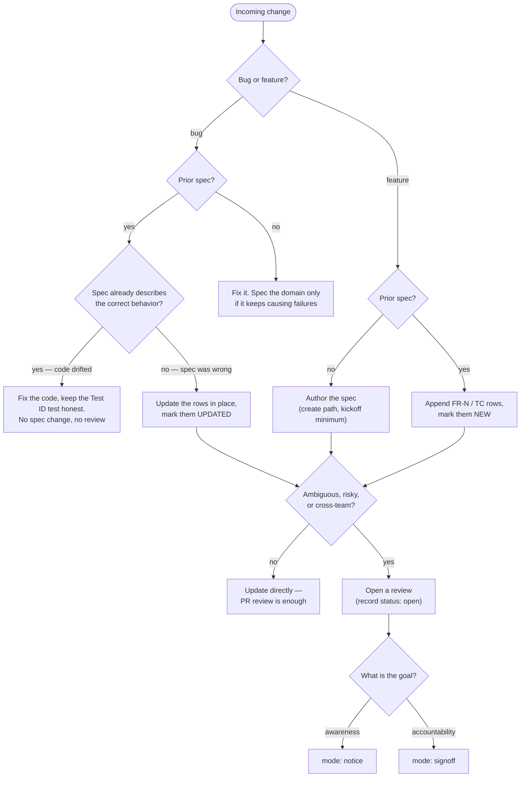

# Review & sign-off in spec-md

This document describes how the people around a `*.spec.md` review it,
acknowledge it, and sign it off. It does this without a copy of the spec in a
second artifact, which can drift.

A spec already carries *what* the system must do (`FR-N`) and *what proves it*
(stable Test IDs). It does not carry *who* has a say, or *what their say means*. Teams
usually solve this with a "sign-off sheet" that restates the requirements for
the stakeholders. That is the error: the sheet and the spec diverge, and the
signature ends up on text that nobody builds from. If the spec says one thing
and the sheet says another, what did the signee approve?

This convention does the opposite. **The review is a structured document beside
the spec, and a stakeholder reads only content derived from the spec.** You
write each briefing for one audience, you generate it again when the spec
changes, and you never maintain it by hand.

---

## Two rules, everything else is style

1. **State the goal.** Every review request declares what it is for. "Get
   sign-off" hides three different goals or more: to make the stakeholders
   *aware*, to give them an *opportunity for input*, or to make them
   *accountable* for a decision. Each goal asks something different of the
   people involved, so the request must say which one applies (see
   [Modes](#modes-notice-vs-signoff)).
2. **Derive it; do not write it by hand.** The spec is the only place where
   you *write* content. Each stakeholder reads a **briefing generated from the
   spec** — written for the role and the concerns of that person, from the
   spec at a pinned version, and it cites the sections and the `FR-N` / Test ID
   rows that it summarizes. Nobody must read the whole spec, and nobody gets a
   generic link to a section. A restatement maintained by hand drifts. A
   derived briefing is disposable: when the spec changes, generate the briefing
   again, as you build a binary from source again. Give this task to an agent —
   point it at the spec, the roles, and the delta.

Rule 2 needs something to derive from: **the spec exists before the review
does**, even as a skeleton draft. The spec does not have to be complete. How
much of it must exist depends on the milestone (see
[Reviewable minimums](#reviewable-minimums)). If there is nothing to derive
from yet, you are not ready for a review.

---

## When a review is warranted

**A review round is never mandatory.** It is overhead. Spend it only where
alignment is at risk. If the work is unambiguous — a bug fix that restores
specified behavior, or a small requirement that everyone already agrees on —
update the spec directly on your branch and let ordinary PR review carry it.
A direct update creates no record and trips no gate, because the
[merge gate](#the-branch-lifecycle) reads review records only, and only when
a spec links one.

The deciding factors are not bug against feature. They are **ambiguity** (can
two reasonable people build different things?), **impact** (how much code, or
how many teams, inherit a mistake?), and **stakeholder spread** (must anyone
outside the PR agree?). Bug or feature, with a prior spec or without one, every
path leads to that one gate:



The left half of the flow is ordinary spec maintenance, and the
[update rules](./SKILL.md) already cover it. The review process in the rest of
this document applies only to the paths that reach `mode: notice` or
`mode: signoff`.

---

## Roles

Roles follow [DACI](https://www.atlassian.com/team-playbook/plays/daci) —
Driver, Approver, Contributors, Informed — and are declared in the review
record's frontmatter.

Each role is asked for something different, and that is the point. A signature
from a person who needed only a notification adds no information. A
notification to a person who needed a veto is a gap.

| Role | Verb | What the review asks of them |
|------|------|------------------------------|
| **Driver** | *proposes* | Authors the spec, runs the review, closes it out. |
| **Approver** | *approves* | Reads their briefing (and whatever it cites), explicitly signs off. Blocking. Ideally one person. |
| **Contributors** | *review* | Domain input within a stated window. Silence past the deadline = no objection ("lazy consensus"). |
| **Informed** | *acknowledge* | Notified with a link. No signature — at most a read-receipt. |

Keep the approver list short, ideally one person. If a spec appears to need
several approvers, it usually covers more than one decision. Divide it into
two specs.

---

## Spec front matter

The spec itself gains a single optional key: where its review lives. The two
documents point at each other — the spec's `review` key, the record's `spec`
key — and everything about the review, **including the approval state**,
belongs to the record. Approval is a property of the review, so that is
where it is tracked; the spec carries no status of its own.

```yaml
---
type: Spec
title: "Spec: Orders"
sources: [./src/orders]
tests: [./test/orders]
review: ./order.review.md
timestamp: 2026-07-09T14:30:00Z
---
```

| Key | Required | Purpose |
|-----|----------|---------|
| `review` | No | Spec-relative path to the review record, e.g. `./order.review.md`. The record's `spec` key points back. |

---

## The review record

The review record is the artifact stakeholders actually interact with. It is
an OKF document like the spec itself — `type: Review` — living **in the
repo, next to the spec**: `order.spec.md` gets an `order.review.md`, and the
spec's `review` key points at it. That completes the frontmatter triad:
`sources` is what implements the spec, `tests` is what proves it, `review`
is who agreed to it.

It is tempting to put the record in a knowledge base, but a review is a
one-time artifact: you generate it, the stakeholders sign it, and it carries
load from then on. Teams reorganize, archive, and lose wiki pages. A record
committed beside the spec keeps its history, lives as long as the code, and the
commit graph binds it to the exact version of the spec it reviewed. That costs
you nothing. If your stakeholders work in Notion or Confluence, publish a
read-only mirror there — the same job that `resource` does for the spec — and
record the outcome in the repo.

### Record frontmatter

The review's identity, participants, and state are metadata. Only `type`,
`title`, and `spec` are required.

```yaml
---
type: Review
title: "Review: Orders — pre-build signoff"
spec: ./order.spec.md
revision: a1b2c3d
mode: signoff
milestone: pre-build
status: open
driver: hank.hill@stricklandpropane.com
approvers: [buck.strickland@stricklandpropane.com]
contributors: [joe.jack@stricklandpropane.com, enrique@stricklandpropane.com]
informed: [support, sales]
deadline: 2026-07-16
resource: https://notion.com/read_only_publish_page_location
timestamp: 2026-07-09T14:30:00Z
---
```

| Key | Required | Purpose |
|-----|----------|---------|
| `type` | **Yes** | Always `Review`. |
| `title` | **Yes** | Human-readable name. |
| `spec` | **Yes** | Path to the spec under review, relative to this file. |
| `status` | No | `open`, then `approved` or `rejected`. The state the [merge gate](#the-branch-lifecycle) reads. A `notice` has nothing to approve and omits it. |
| `revision` | No | The spec commit the briefings were derived from. |
| `mode` | No | `notice` or `signoff` (see [Modes](#modes-notice-vs-signoff)). |
| `milestone` | No | `kickoff`, `pre-build`, or `pre-release`. |
| `driver` | No | Runs the review; usually the spec's author. |
| `approvers` | No | Who must explicitly sign off. Keep it to one or two. |
| `contributors` | No | Who is asked for input. People or team aliases. |
| `informed` | No | Who gets notified. Nothing is asked of them. |
| `deadline` | No | When the round closes; contributor silence past it = no objection. |
| `resource` | No | Read-only mirror in the knowledge base, if stakeholders live there. |
| `timestamp` | No | ISO 8601 of last update. |

`status: approved` does **not** freeze the spec. It records that this review
concluded; the spec keeps living.

### Record body

The body applies rule 2: derive it, never write it by hand. It contains:

- The **goal and the instructions**, stated at the start.
- The **roles table** — who holds each role and what you ask of them, with
  checkboxes for the approvers only.
- A **briefing for each stakeholder** — written for the role and the concerns
  of that person, from the spec at the pinned `revision`. It cites the sections
  and the `FR-N` / Test ID rows that it summarizes, so every claim is one click
  from its source. The briefing is the whole request. The rest of the spec is
  context, and the stakeholder does not have to read it. Let an agent draft
  each briefing, because the spec, the roles, and the delta are all
  machine-readable. Generate them again when the spec changes.
- The **outcome**, after the round closes.

Write the record in [Simplified Technical English](./README.md#the-language),
the same as the spec it comes from. A signature is only as good as the sentence
above it, so each briefing must have one meaning only.

### One record, one review

A record is **one review** — one go or no-go decision before the work. Most
specs have only one. A second round is the exception, not the shape of the
file. When a spec later changes enough to need a new review, **write the record
again in place**: a new `revision`, `status` back to `open`, and new briefings
that cover the delta by `FR-N` / Test ID id. You derive that delta from the
history of the spec, and you copy nothing by hand. The old round is not lost.
It is one commit away. Git history is the archive, so the file never becomes a
changelog.

### Distribution

One record means one thing to hand out. Publish the file (or its `resource`
mirror) and put the link in Slack. That is the whole delivery mechanism, by
design. We validate the convention on a manual loop first, so there is no
notification tooling to configure or maintain. If the loop proves its value,
automate the distribution later.

### Modes: notice vs. signoff

The mode answers rule 1 — what is this review *for?*

- **`notice`** — the goal is awareness. You collect no signatures, and the
  record carries no `status`, because there is nothing to approve. The record
  is a broadcast that contains the briefings and an open invitation to comment.
  At most, record the acknowledgments, to learn who reads what you send.
- **`signoff`** — the goal is accountability. The record carries `status`
  (`open` → `approved` or `rejected`). Each approver must check the box.
  Contributors get a window for input. The driver ships when the approvals are
  complete, or when the deadline passes with no objection.

If people only need to know that something is in progress, send a notice. Do
not manufacture signatures. If a person is accountable for the outcome, that
person reads the spec and signs against it.

### Example

```md
---
type: Review
title: "Review: Orders — pre-build signoff"
spec: ./order.spec.md
revision: a1b2c3d
mode: signoff
milestone: pre-build
status: open
driver: hank.hill@stricklandpropane.com
approvers: [buck.strickland@stricklandpropane.com]
contributors: [joe.jack@stricklandpropane.com, enrique@stricklandpropane.com]
informed: [support, sales]
deadline: 2026-07-16
---

The briefing below is the whole request. We wrote it for your role from
[the spec](./order.spec.md) at revision `a1b2c3d`, and every claim in it cites
the section or the ID it comes from. If it is correct and complete for your
area, check the box next to your name to record your approval. If something is
wrong or absent, comment on the spec or tell the driver. We ship when every
approver signs off. If a contributor says nothing before the deadline, we read
that as "no objection".

| Role | Who | Asked to | Done |
|------|-----|----------|------|
| Approver | Buck (Product) | Approve | [ ] |
| Contributor | Joe Jack (QA) | Review and comment before the deadline | — |
| Contributor | Enrique (Design) | Review and comment before the deadline | — |
| Informed | Support, Sales | Nothing — for information | — |

### Briefings

**Buck (Product)** — You approve what Orders commits to. The system prices an
order from validated input, and no one can change the order after a customer
places it ([FR-3](./order.spec.md#functional-requirements)). A refund flow is
the only way to adjust an order. Payments and inventory stay out of this system
([Scope](./order.spec.md#scope)).

**Joe Jack (QA)** — The acceptance criteria are the rows in
[QA Test Cases](./order.spec.md#qa-test-cases). The API returns a validation
error for an invalid request ([TC-91CX]). It returns 404 for an unknown order id
([TC-JKUK]). Tell us before the deadline about each case your harness cannot
assert.

**Enrique (Design)** — A customer cannot edit an order after purchase. After a
customer places an order, the customer can only view it or refund it ([FR-3]).
Tell us now if the confirmation flow you design expects an edit.

**Outcome:** pending — closes 2026-07-16.
```

---

## Milestones, not gates

You can request a review at any point in the life of a spec, and the record
says which point that is. The spec always exists before the review does, which
is what makes rule 2 possible. But how much of it exists depends on the
milestone.

### Reviewable minimums

Each milestone has a reviewable minimum: the sections that must be written
for the review to mean anything, and the question the review is actually
asking.

| Milestone | The spec has at least | The review asks |
|-----------|-----------------------|-----------------|
| **Kickoff** | Frontmatter (`type`, `title`), Intro, Scope — `??` markers and gaps welcome | Are we solving the right problem, with the right boundaries? |
| **Pre-build** | + Definitions and Functional Requirements (`FR-N`); QA Test Cases for the core paths | Is this the behavior we want built? |
| **Pre-release** | + full Test ID coverage, `sources`/`tests` linked | Did we ship what the spec says? |

A signee at kickoff approves the boundaries, not the behavior, and the
milestone in the record tells them which one. Below the kickoff minimum there
is no review to run. If you have only an idea, that is a conversation, not a
review record.

Nothing here requires a *complete* spec before you involve people. A kickoff
review of a spec that is mostly Scope and open questions is a good review. The
hand-off and the authoring can overlap. The milestone states which stage of the
spec each person reads, so that nobody signs off on requirements that do not
exist yet.

### The branch lifecycle

The spec and its review record are files, so the review follows the same
workflow as the code:

1. You draft the spec and its record on a **feature branch**, and the record
   starts with `status: open`.
2. The review runs **on the pull request**. An approver who works in the repo
   can sign through a PR approval. The driver checks the boxes in the record in
   both cases, so the record is the system of record, not the platform.
3. The review concludes. The driver sets `status: approved`, sets a new
   `timestamp`, and the PR merges. The main branch carries approved reviews
   only.

CI holds the gate:

```bash
npx @rosenjcb/spec-md check --require-approved
```

This command fails while any spec links a review record whose `status` is not
`approved`. It is the **only** enforcement in the convention, and you opt in
twice: you must pass the flag, and a spec that links no review is not gated. A
`notice` is not gated either, because it carries no `status`. By design, no
rule cancels a signature when a spec changes after its review. The driver
decides when a new review is necessary. The `[NEW]` and `[UPDATED]` markers,
with contiguous `FR-N` ids and stable Test IDs, make "what changed since you last looked"
cheap to communicate, and you restate nothing. We want a baseline of how teams
use reviews — how many people read, acknowledge, and comment — before we add
more enforcement.

---

## Worked example

[`examples/pizza-ts`](./examples/pizza-ts):
[`order.spec.md`](./examples/pizza-ts/specs/order.spec.md) links
[`order.review.md`](./examples/pizza-ts/specs/order.review.md) — an approved
pre-build signoff with roles, per-stakeholder briefings, and approval state.

### Further reading

- ASD-STE100 Simplified Technical English: https://www.asd-ste100.org/
- Atlassian Team Playbook, DACI: https://www.atlassian.com/team-playbook/plays/daci
- MADR — Markdown Architecture Decision Records: https://adr.github.io/madr/
- PEP 1 — PEP Purpose and Guidelines: https://peps.python.org/pep-0001/
- Rust RFC final comment period: https://forge.rust-lang.org/lang/fcp.html
- DORA, Streamlining change approval: https://dora.dev/capabilities/streamlining-change-approval/
