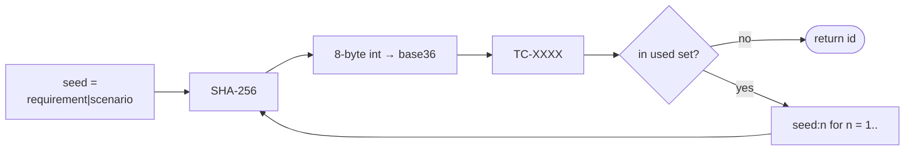

# spec-md CLI

Lint, coverage, and scaffolding tooling for [`*.spec.md`](https://github.com/rosenjcb/spec.md)
documents. Zero runtime dependencies, works with Node ≥ 18.

`spec-md` treats your specs as a checkable artifact. It validates the
frontmatter and the `FR-N` / Test ID structure. It also cross-references each
Test ID against the `[TC-XXXX]` tags in your test suite, so that spec coverage
becomes a CI gate.

## Install

```bash
# one-off, no install
npx @rosenjcb/spec-md lint

# project dev dependency
npm install --save-dev @rosenjcb/spec-md

# global
npm install --global @rosenjcb/spec-md
```

## Commands

| Command | What it does |
|---------|--------------|
| `spec-md lint [paths…]` | Validate frontmatter (`type`, `title`, path fields incl. `review`, `timestamp`, `resource` URLs on specs and linked reviews), FR ids (unique, contiguous, ascending `1..n`), Test IDs (`TC-[A-Z0-9]{4}`, unique within the spec), duplicate ids, and TC→FR references. |
| `spec-md coverage [paths…]` | Report which Test IDs have at least one `[TC-XXXX]` test, and flag tags that reference an id the spec never declares. |
| `spec-md check [paths…]` | `lint` + `coverage`, strict. The one to run in CI. |
| `spec-md list [paths…]` | List every spec with FR/TC counts and a coverage bar. |
| `spec-md new <domain>` | Scaffold `<domain>.spec.md` from the canonical template — the sections, the id rules, and the [Simplified Technical English](https://github.com/rosenjcb/spec.md#the-language) house style. (`create` / `init` aliases) |
| `spec-md id` | Generate a stable `TC-XXXX` from a requirement + scenario seed (`--requirement`, `--scenario`, optional `--used`). |
| `spec-md migrate-ids [paths…]` | Rewrite legacy sequential `TC-N` rows and matching `[TC-N]` tags to stable `TC-XXXX` ids. Idempotent. Use `--dry-run` to plan only. |

Paths default to the current directory. The CLI searches them recursively for
`*.spec.md` files, and skips build and dependency directories.

### Options

| Flag | Applies to | Meaning |
|------|-----------|---------|
| `--strict` | lint, coverage, check | Exit non-zero on warnings / coverage gaps. |
| `--require-approved` | lint, check | Fail unless every review record linked from a spec's `review` key has `status: approved`. Specs with no linked review — and notice records with no `status` — are not gated; the [review lifecycle](https://github.com/rosenjcb/spec.md/blob/main/REVIEW.md) is opt-in per spec. |
| `--json` | lint, coverage, list, migrate-ids | Machine-readable output. |
| `--tests <path>` | coverage | Search this path for `[TC-XXXX]` tags instead of the spec's `tests` field. |
| `--out <path>` | new | Output file path. |
| `--sources`, `--tests`, `--title` | new | Seed the generated frontmatter. |
| `--force` | new | Overwrite an existing file. |
| `--requirement`, `--scenario`, `--used` | id | Seed and collision set for a new Test ID. |
| `--dry-run` | migrate-ids | Plan rewrites without writing files. |

## How coverage works

The `tests` frontmatter field of a spec points at where its verification lives.
`spec-md coverage` reads those spec-relative paths, scans them for the
`[TC-XXXX]` tags in the test names, and matches the tags against the Test ID
rows of the spec. If a spec declares no
`tests`, the search uses the paths you gave on the command line. Ids are
opaque strings — never sorted or ranged as numbers.

```
$ spec-md coverage examples/pizza-ts
████████████████████ 100% examples/pizza-ts/specs/order.spec.md (9/9)

✓ Overall 100% — 9/9 test cases have a [TC-XXXX] test
```

## Stable Test IDs

A Test ID has the form `TC-[A-Z0-9]{4}` (for example `TC-K7MF`). It is:

- **stable** — edit the scenario text without changing the id;
- **opaque** — no ordering and no encoded semantics;
- **scoped to the spec** — the same suffix may appear in two different specs;
- **generated once** — hash of the initial requirement + scenario seed, with
  deterministic collision resolution; after write, never recompute.

### Allocation algorithm



| Step | What happens |
|------|----------------|
| Seed | `trim(requirement) + "\|" + trim(scenario)`. Expected Outcome is **not** in the seed. |
| Hash | SHA-256 of the UTF-8 seed. Take the first 8 bytes as a big-endian integer. Emit four base36 digits (`0-9A-Z`). |
| Prefix | `TC-` + those four characters. |
| Collision | If the candidate is already in the `used` set for this spec, hash `seed:1`, then `seed:2`, and so on, until free (open-addressing style). Deterministic for a given seed + used set. |
| Permanent | Once the id is written into the `*.spec.md` table, it is the join key forever. Edit row text in place; do not regenerate. |

```bash
spec-md id --requirement FR-4 --scenario "The request has no customerId"
spec-md id --requirement FR-4 --scenario "…" --used TC-K7MF,TC-2QXR
```

### Migration

Legacy sequential tables (`TC-1`, `TC-2`, …) fail `lint`. Run:

```bash
spec-md migrate-ids .
# plan only:
spec-md migrate-ids . --dry-run --json
```

`migrate-ids` rewrites, per spec:

1. every legacy `TC-N` cell → a new `TC-XXXX` from that row’s requirement + scenario;
2. matching `[TC-N]` tags under the spec’s `tests` paths;
3. TC tokens in the linked `review` record (if local).

Already-stable ids are left alone. The command is idempotent. Whole-token
rewrite avoids turning `TC-10` into something derived from `TC-1`.

## Exit codes

- `0` — success (lint clean of errors; coverage complete when `--strict`).
- `1` — lint errors, or `--strict` warnings / coverage gaps.
- `2` — usage error / unexpected failure.

## In CI

```yaml
- run: npx @rosenjcb/spec-md check --strict
```

To use the spec review as a merge gate, put the spec and its review record on
the same feature branch. CI stays red until the `status` of the record becomes
`approved`:

```yaml
- run: npx @rosenjcb/spec-md check --strict --require-approved
```

See the repository root for a reusable GitHub Action (`rosenjcb/spec.md`) that
wraps this command.
